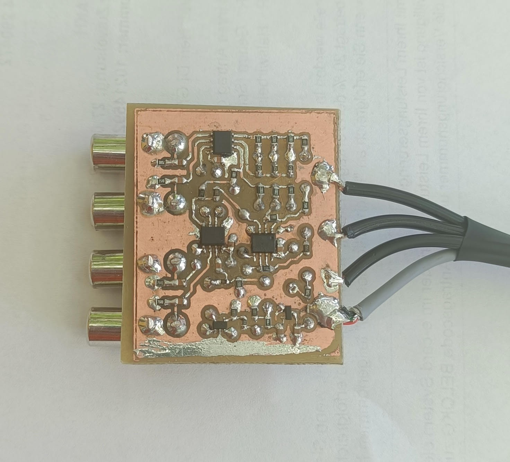
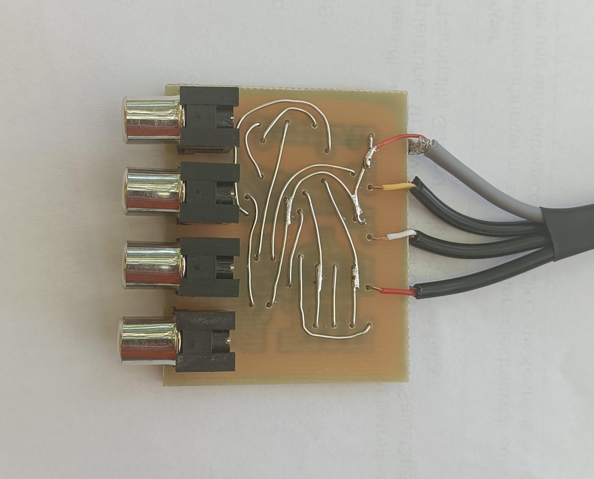

# RGBStoYPbPr

A fairly simple video converter from RGBS to YPbPr. My main challenge here is to make it work with only stuff that I have incidentially at home.
 
The PCB is a small single-sided leftover piece that was just big enough to fit the circuitry. Home etching, using the well-known toner transfer method,
turned out pretty nicely. To create the necessary non-standard resistor values, I soldered several resistors on top of each other. 
When allowing up to three resistors in a parallel configuration, the computer search finds an extremly good fit for every desired value
by using only the E6 series.

